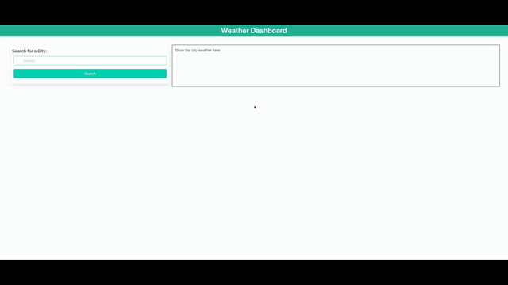

# week-06-challenge-calendar-dashboard

## Description

The challenge is to build a weather dashboard that displays the current and 5-day forecast weather of a city searched by the user. The weather data is generated from an open weather API - `https://api.openweathermap.org/data/2.5/forecast?lat={lat}&lon={lon}&appid={API key}`.

## User Story

```
AS A traveler
I WANT to see the weather outlook for multiple cities
SO THAT I can plan a trip accordingly
```

## Acceptance Criteria

A weather dashboard is presented on a page with a two-column design. The left column contains an input element allowing users to enter a city. If it exists, it will display the current city weather and 5-day forecasts on the right column, consisting of the city name, date, and an icon presenting the weather conditions, temperature, wind, and humidity. Listed below the search button is the city search history. Each city links to its current and 5-day forecast weather details. 

## Technologies used

This application is built utilizing the following:

* HTML
* CSS
* JavaScript
* API -  [https://openweathermap.org/api](https://openweathermap.org/api)

## Mock-up

The video below demonstrates the functionality of the weather dashboard.



## Requirements

Below are the requirements for this challenge. 

* URL of the deployed application:
[https://mayperalta.github.io/week-06-challenge-calendar-dashboard/week-06-challenge-calendar-dashboard/](https://mayperalta.github.io/week-06-challenge-calendar-dashboard/week-06-challenge-calendar-dashboard/)

* URL of the GitHub Repositiory:
[https://github.com/mayperalta/week-06-weather-dashboard](https://github.com/mayperalta/week-06-weather-dashboard)